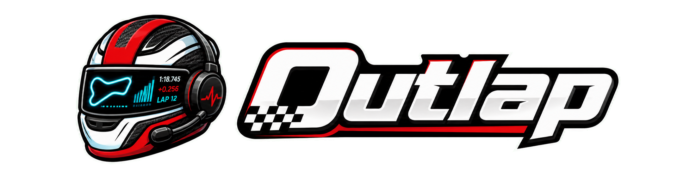

<p align="center">
  
</p>

<p align="center">
  <a href="https://github.com/In-sp3ctr3/outlap/actions/workflows/check.yml"></a>
  <a href="https://github.com/In-sp3ctr3/outlap/actions/workflows/codeql.yml"></a>
  <a href="https://github.com/In-sp3ctr3/outlap/actions/workflows/secret-scan.yml"></a>
  <a href="LICENSE"></a>
  <a href="CONTRIBUTING.md"></a>
  
</p>

# Outlap

Outlap is an unofficial, local-first fantasy motorsport strategy dashboard. It combines synthetic or user-imported fantasy team data, race-week context, deterministic projections, legal lineup optimization, and optional bring-your-own AI explanations.

The project deliberately avoids official motorsport branding, logos, team marks, driver imagery, broadcast assets, and any suggestion of affiliation or endorsement.

## Status

The v1 local demo is implemented and covered by CI. The current product includes:

- Next.js web app;
- FastAPI API;
- DuckDB-backed local storage;
- deterministic rules, projections, and optimizer;
- manual import and demo fixtures;
- data-health degradation paths;
- read-only AI provider adapters and local Ollama smoke coverage;
- Playwright end-to-end tests.

## Product Promise

Given a fantasy team, budget, transfer allowance, chip state, race-week context, prices, projections, and risk appetite, Outlap recommends legal moves and explains the tradeoffs.

The AI layer never calculates final scores, transfer penalties, budgets, or optimized lineups. It can only explain deterministic outputs and use read-only tools.

## Repository Layout

```text
apps/
  api/      FastAPI API, domain core, storage adapters, tests
  web/      Next.js app, UI components, Playwright tests
packages/
  fixtures/ Synthetic demo data safe for open-source use
api/        OpenAPI contract from the v1 spec
schemas/    JSON Schemas for shared contracts
docs/       Product, architecture, security, testing, and ADR docs
specs/      Implementation gate records and verification notes
data/       Local DuckDB files, ignored by Git
```

See [docs/architecture/repository-architecture.md](docs/architecture/repository-architecture.md) for module boundaries and file standards.

## Requirements

- Node.js 24+
- pnpm 11.5.2
- Python 3.12 or 3.13
- uv 0.8+
- Docker 26+ and Docker Compose v2.38+ for containerized local mode

The original v1 spec pins a June 2026 baseline. Local development currently supports Python 3.12 so the project can run on the available toolchain while staying compatible with the 3.13 target.

## Quick Start

```bash
pnpm install
cd apps/api && uv sync && cd ../..
make dev
```

Open `http://127.0.0.1:3000`.

## Common Commands

```bash
make setup       # install web and API dependencies
make dev         # run API and web app locally
make test        # backend and frontend tests
make lint        # ruff and eslint
make typecheck   # mypy and TypeScript
make e2e         # Playwright
make check       # lint, typecheck, tests, e2e
make demo        # run the demo/backtest CLI path
```

## Configuration

Copy `.env.example` to `.env` for local overrides. Provider API keys are optional and bring-your-own-key. Secrets must stay out of logs, fixtures, snapshots, and commits.

## Testing

The test plan follows the v1 spec:

- unit tests for rules, transfers, chips, projections, and optimizer behavior;
- API tests for public endpoints and failure states;
- frontend tests for component logic;
- Playwright flows for demo setup, manual/import-style strategy, degraded data, provider failure, and responsive smoke coverage.

## Documentation

- [Master specification](MASTER_SPEC.md)
- [Implementation brief](docs/00_IMPLEMENTATION_AGENT_BRIEF.md)
- [Architecture](docs/04_ARCHITECTURE.md)
- [Testing strategy](docs/12_TESTING_TDD_QA.md)
- [Implementation checklist](docs/20_IMPLEMENTATION_CHECKLIST.md)
- [Changelog](CHANGELOG.md)

## Contributing

See [CONTRIBUTING.md](CONTRIBUTING.md). Commits should be small, reviewable, and written in normal Conventional Commit style. Avoid generated-code disclaimers, tool branding, and noisy commit trailers.

## Security

See [SECURITY.md](SECURITY.md). Do not report vulnerabilities through public issues.

## License

MIT. See [LICENSE](LICENSE).

## Legal Notice

Outlap is an unofficial fan-made fantasy analytics tool. It is not affiliated with, endorsed by, or sponsored by Formula 1, Formula One Management, or any team/constructor. Users are responsible for complying with the terms of the services they connect.
